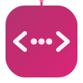

<div align="center">



# CodePick

**Programming Language Selector Chatbot**

A rule-based chatbot that helps you choose the right programming language for your project.

[](https://github.com/AleenaTahir1/CodePick/actions)
[](LICENSE.txt)

**[Live Demo](https://aleenatahir1.github.io/CodePick/)**

</div>

---

## Overview

CodePick is an ELIZA-style rule-based chatbot built with React and Tailwind CSS. It uses pattern matching and keyword detection with 50+ rules to drive conversations and deliver personalized programming language recommendations.

---

## Features

- Interactive chat interface with typing indicators
- Pattern matching for free-form user input
- 50+ rules covering 8 project categories
- Quick-reply buttons for guided conversation
- Personalized recommendations with alternatives and reasoning
- Responsive, mobile-friendly design
- Dockerized deployment with Nginx

---

## How to Run

```bash
git clone https://github.com/AleenaTahir1/CodePick.git
cd CodePick
docker-compose up --build
```

Open **http://localhost:3000** in your browser. That's it!

---

## Tech Stack

| Layer            | Technology                          |
|------------------|-------------------------------------|
| Frontend         | React (Vite) + Tailwind CSS         |
| Rule Engine      | Vanilla JavaScript (client-side)    |
| Containerization | Docker + docker-compose             |
| CI/CD            | GitHub Actions                      |
| Hosting          | Nginx (serving static build)        |

---

## Project Structure

```
CodePick/
├── src/
│   ├── components/      — ChatWindow, MessageBubble, InputBar, QuickReplyButtons
│   ├── engine/          — chatEngine.js, patterns.js, rules.js, responses.js
│   ├── App.jsx
│   ├── main.jsx
│   └── index.css
├── public/              — favicon.svg, logo.svg
├── Dockerfile
├── docker-compose.yml
├── nginx.conf
├── .github/workflows/ci.yml
├── package.json
└── README.md
```

---

## License

This project uses a **Source Available** license. See [LICENSE.txt](LICENSE.txt) for details.

---

## Authors

- **Aleena Tahir** — aleenatahirf23@nutech.edu.pk
- **Saqlain Abbas** — saqlainabbasf23@nutech.edu.pk
- **Emaan Kiani** — emankianif23@nutech.edu.pk
- **Aena Habib** — aenahabibf23@nutech.edu.pk
- **Dua Kamal** — duakamalf23@nutech.edu.pk
